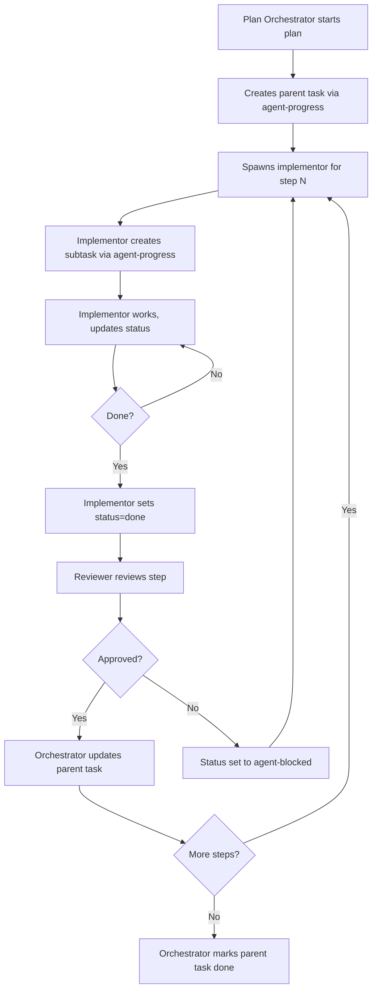

# PLAN: Agent Progress Tracking System

## Goal

Build a project-board-style progress tracking system that agents use to communicate task
status to the human operator. It comprises a Rust CLI (`agent-progress`) with CRUD
operations and a TUI board view, a new `agent-progress` skill, a new `agent-worktree`
skill (factored from existing plan-* scripts), and integration updates across the
plan-author, plan-orchestrator, plan-implementor, plan-reviewer, and memory skills.

## Decision flowchart

## Scope

All changes span `~/dotfiles/rust/agent-progress/` (new Rust crate),
`~/.pi/agent/skills/` (new and updated skills), and `~/dotfiles/AGENTS.md`.

| File | Purpose |
|------|---------|
| `rust/agent-progress/` | New Rust CLI crate — CRUD, list, TUI |
| `~/.pi/agent/skills/agent-progress/SKILL.md` | New skill teaching agents when and how to use the CLI |
| `~/.pi/agent/skills/agent-worktree/SKILL.md` | New skill: worktree management extracted from plan-* |
| `~/.pi/agent/skills/agent-worktree/scripts/` | Worktree scripts moved from plan-orchestrator and plan-implementor |
| `~/.pi/agent/skills/plan-author/SKILL.md` | Add `handle` frontmatter requirement to PLAN.md format |
| `~/.pi/agent/skills/plan-orchestrator/SKILL.md` | Integrate progress tracking + reference agent-worktree |
| `~/.pi/agent/skills/plan-implementor/SKILL.md` | Integrate progress tracking + reference agent-worktree |
| `~/.pi/agent/skills/plan-reviewer/SKILL.md` | Reference agent-worktree (minor) |
| `~/.pi/agent/skills/memory/SKILL.md` | Add guidance on creating memories for out-of-scope discoveries |
| `AGENTS.md` | Register new skills in available_skills |

## Steps

| # | File | Description |
|---|------|-------------|
| 0 | `PLAN/00_rust_project_scaffold.md` | Scaffold the Rust crate with Cargo.toml, module structure, and DB schema |
| 1 | `PLAN/01_domain_models.md` | Define the pure domain types: Task, Status, Tag, and formatting logic |
| 2 | `PLAN/02_database_layer.md` | SQLite database layer: migrations, CRUD operations |
| 3 | `PLAN/03_cli_commands.md` | CLI command parsing with clap: create, update, list, show, tag |
| 4 | `PLAN/04_cli_output_formats.md` | YAML and JSON output formatting for list and show |
| 5 | `PLAN/05_tui_functional_core.md` | TUI state management: filtering, column layout, search — pure functions |
| 6 | `PLAN/06_tui_rendering.md` | TUI rendering with ratatui: board view, search bar, keybindings |
| 7 | `PLAN/07_agent_worktree_skill.md` | Extract worktree management into a standalone agent-worktree skill |
| 8 | `PLAN/08_agent_progress_skill.md` | Write the agent-progress SKILL.md |
| 9 | `PLAN/09_plan_author_handle.md` | Add `handle` frontmatter to PLAN.md format in plan-author skill |
| 10 | `PLAN/10_plan_skill_integrations.md` | Update plan-orchestrator, plan-implementor, plan-reviewer for progress + worktree refs |
| 11 | `PLAN/11_memory_skill_update.md` | Update memory skill with out-of-scope discovery guidance |
| 12 | `PLAN/12_agents_md_registration.md` | Register new skills in AGENTS.md available_skills |

## Invariants

- `cargo test` passes in `rust/agent-progress/` after every step that touches Rust code
- `cargo clippy` produces no warnings after every Rust step
- All existing skill functionality is preserved — updates are additive or replace references, never remove capabilities
- The SQLite database at `~/agent_progress.sqlite` is the single source of truth; no other storage
- The schema includes a version table from step 0, even though migrations are unused now
- Every PLAN.md produced by plan-author will have a `handle` frontmatter field after step 9
- The dependency graph across skills is acyclic: memory and progress know nothing about plan-*; plan-* skills reference progress and memory; progress can reference memory but not vice versa
- Worktree scripts are moved to agent-worktree, not duplicated — plan-* skills reference the new location

<!-- step-07-applied: created ~/.pi/agent/skills/agent-worktree/ with all scripts moved from plan-orchestrator and plan-implementor; updated orchestrator and implementor SKILL.md files -->
<!-- step-08-applied: created ~/.pi/agent/skills/agent-progress/SKILL.md -->

<!-- step-09-applied: updated ~/.pi/agent/skills/plan-author/SKILL.md with handle frontmatter -->

<!-- step-11-applied: updated ~/.pi/agent/skills/memory/SKILL.md -->

<!-- step-10-applied: updated plan-orchestrator, plan-implementor, and plan-reviewer SKILL.md with agent-progress task tracking and agent-worktree references -->

<!-- step-12-applied: added agent-progress and agent-worktree to ~/.pi/agent/AGENTS.md available_skills -->
